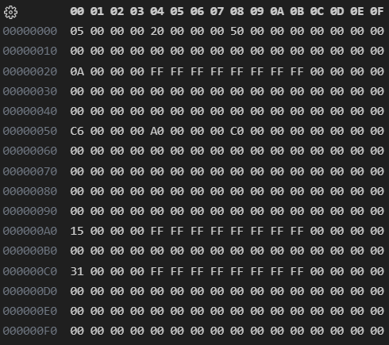

# HW4-6-1 測資檔案說明

`testcase.zip`內有3個資料夾，分別為`input_obj`,`input_txt`與`output_txt`，其中：

## input_obj
內為提供程式讀取的obj檔，為二進位檔案，可以使用裝有 HEX Editor 套件的 VScode 打開。

- 這是範例測資(1.obj)使用二進位編輯器打開的樣子



## input_txt
內為提供給人看的文字檔，其中描述了對應編號的obj檔中，節點的分布情況。
內有多行，格式如下：
```
節點在檔案中的位置:節點內容(little endian,並用一個空格將每4個bytes隔開)
```
舉例：
```
00000000:05000000 20000000 50000000
```
代表在檔案的第0x00000000個byte開始有一個節點，他的value是0x00000005(5<sub>10</sub>)，他的左節點在檔案中0x00000020(32<sub>10</sub>))的位置，而右節點在檔案中0x00000050(80<sub>10</sub>))的位置

## output_txt
對應編號的obj檔的正確輸出